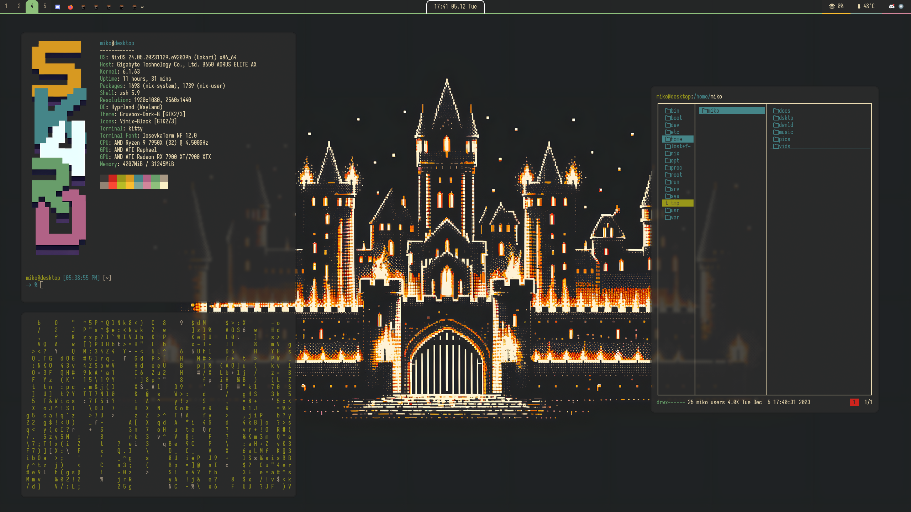

#+title: Sk4rd's NixOS & Home-Manager Config using Flakes
This is my NixOS and Home-Manager configuration using *flakes*. It is
what I’ve come up with, that satisfies my needs. If you, dear reader,
intend on using my configuration, make sure to edit all system
specific options. This setup is designed for efficiency and speed by
making use of the *Hyprland* window manager, *Emacs*, and other cool
programs.

** Showcase: Desktop

